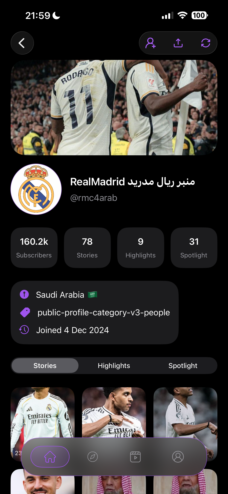
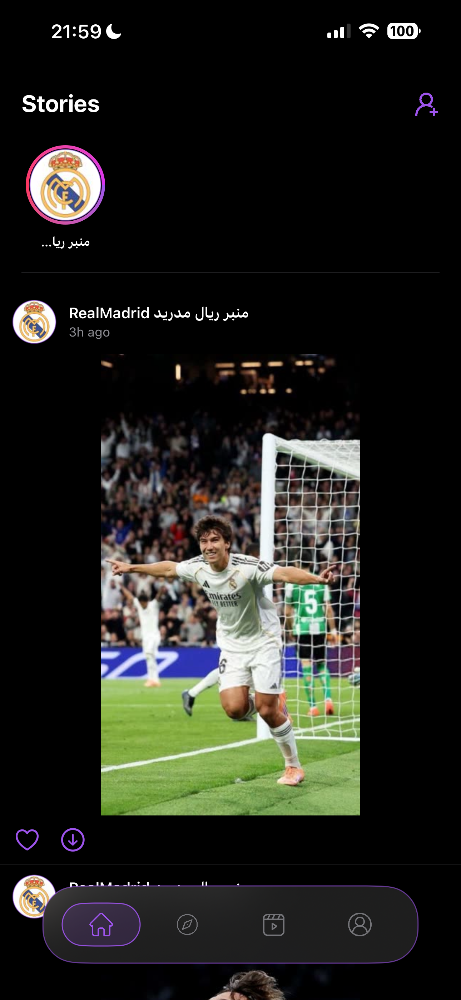
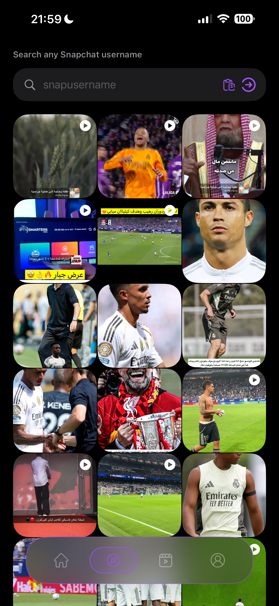
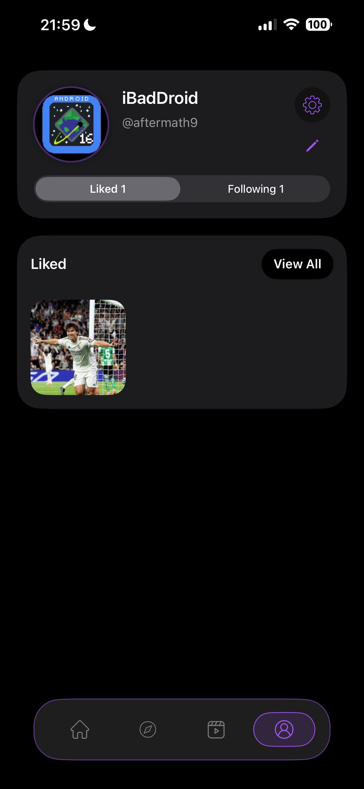

# Retain

Retain is a sophisticated social media companion application designed to empower users with greater control over their public profile interactions. It provides a centralized platform for viewing, managing, and preserving media from public sources in a high-performance, intuitive interface.

## Core Features

### Public Profile Aggregation
Retain allows users to follow public profiles and usernames by aggregating content into a unified experience. By simply adding a profile, users can stay updated with the latest media without the need for multiple accounts or switching between different platforms.

### Immersive Media Experience
The application offers a multi-faceted feed system tailored for modern content consumption:
* Stories: A streamlined viewer for temporary updates from followed profiles.
* Reels: A dedicated video player for short-form entertainment and immersive viewing.
* Explorer: A discovery tool that allows users to search for any public username and explore their media catalog.

### Content Preservation and Interaction
Beyond viewing, Retain provides advanced tools for media management and interaction:
* Permanent Likes: Save content to a personal collection. Unlike standard social platforms where temporary content eventually expires or disappears, Retain ensures that liked media remains preserved and accessible within the user profile indefinitely.
* Direct Downloads: High-quality media downloading capability for offline viewing and personal archiving.
* Interactive Engagement: Like and interact with media directly within the application's timeline.

### Personalized User Profile
The user profile serves as a private dashboard, organizing all saved media and providing an overview of followed accounts. It is designed for efficient content management and quick access to archived media.

### Customizable Experience
A comprehensive suite of settings allows users to explore and tailor the application behavior to their personal preferences, including media display options and advanced interface controls.

## Visual Overview

  
  

  
  

## Releases

### Retain Version 1.0 (Latest)
The first official release of the Retain application, optimized for mobile and tablet devices.

> [!TIP]
> **[Download Retain_1.0.zip](releases/Retain_1.0.zip)**
> *Includes Retain_1.0.ipa for iOS and iPadOS*

---

#### Features in this version:
* Initial public profile integration.
* Full media timeline for Stories, Reels, and Explorer.
* Permanent content preservation (Likes).
* Direct media downloads.
